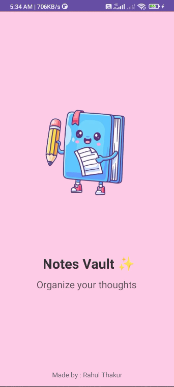
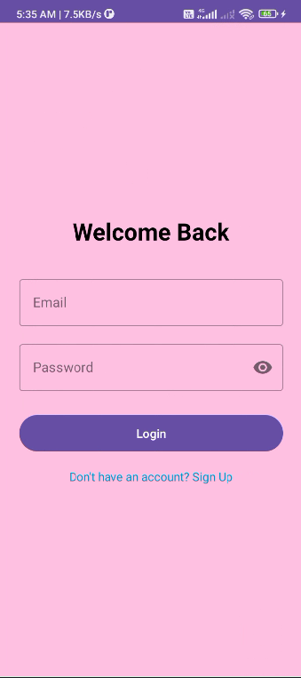
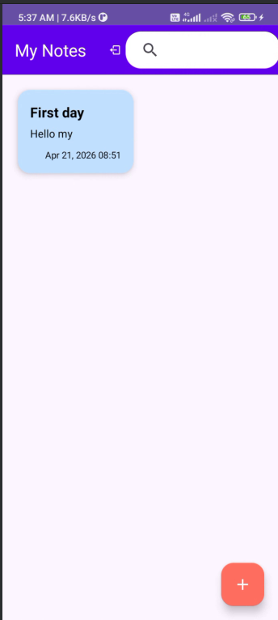
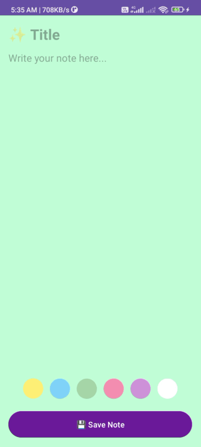

# 📦 NoteVault - Android Notes Applicatio

<p align="center">
  
  
  
  
</p>

<p align="center">
  <h3 align="center">📝 NoteVault</h3>
  <p align="center">
    A modern Notes Application built using Kotlin, XML, MVVM Architecture, and Room Database.
  </p>
</p>

---

## ✨ Overview

NoteVault is a modern Android Note Application that allows users to create, edit, delete, and organize notes efficiently. The app follows the MVVM architecture and uses Room Database for secure offline storage, providing a smooth and responsive user experience.

---

## 🚀 Features

* 🔐 User Authentication (Login & Signup)
* 📝 Create Notes
* ✏️ Edit Existing Notes
* 🗑️ Delete Notes
* 🔍 Search Notes Instantly
* 💾 Offline Storage using Room Database
* 🎨 Material Design UI
* ⚡ Fast & Responsive Experience
* 🚀 Splash Screen

---

## 🛠️ Tech Stack

| Technology     | Description             |
| -------------- | ----------------------- |
| Kotlin         | Programming Language    |
| XML            | User Interface Design   |
| MVVM           | Architecture Pattern    |
| Room Database  | Local Data Storage      |
| Coroutines     | Asynchronous Operations |
| Android Studio | Development Environment |

---

## 📸 Application Screenshots

<table>
<tr>
<td align="center">
<br>
<b>Splash Screen</b>
</td>

<td align="center">
<br>
<b>Login Screen</b>
</td>
</tr>

<tr>
<td align="center">
<br>
<b>Home Screen</b>
</td>

<td align="center">
<br>
<b>Add Note Screen</b>
</td>
</tr>
</table>

---

## 📂 Project Structure

```text
NoteVault-Android
│
├── app
│   ├── src
│   │   ├── main
│   │   │   ├── java
│   │   │   │   ├── data
│   │   │   │   ├── repository
│   │   │   │   ├── viewmodel
│   │   │   │   ├── ui
│   │   │   │   │   ├── auth
│   │   │   │   │   ├── notes
│   │   │   │   │   └── splash
│   │   │   │   └── utils
│   │   │   └── res
│   │   └── AndroidManifest.xml
│
├── Screenshots
│   ├── splash.png
│   ├── login.png
│   ├── home.png
│   └── add_note.png
│
└── README.md
```

---

## ⚙️ Installation

### Clone the Repository

```bash
git clone https://github.com/RahulThakur-28/NoteVault-Android.git
```

### Open in Android Studio

```text
1. Open Android Studio
2. Clone/Open the project
3. Sync Gradle
4. Run the application
```

---

## 🎯 Future Enhancements

* ☁️ Firebase Authentication
* ☁️ Cloud Sync & Backup
* 🔔 Reminder Notifications
* 🌙 Dark Mode Support
* 📌 Pin Important Notes
* 🤖 AI-Based Note Summarization

---

## 👨‍💻 Developer

**Rahul Thakur**

* Android Developer
* Kotlin Enthusiast
* DSA & Problem Solving

GitHub: https://github.com/RahulThakur-28

---

## ⭐ Support

If you found this project useful, please give it a ⭐ on GitHub.

Your support motivates me for  future development and improvements.
